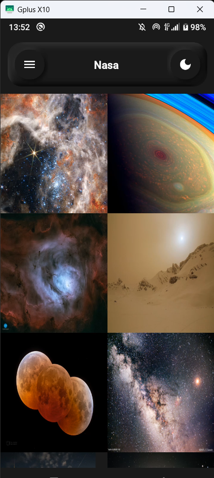
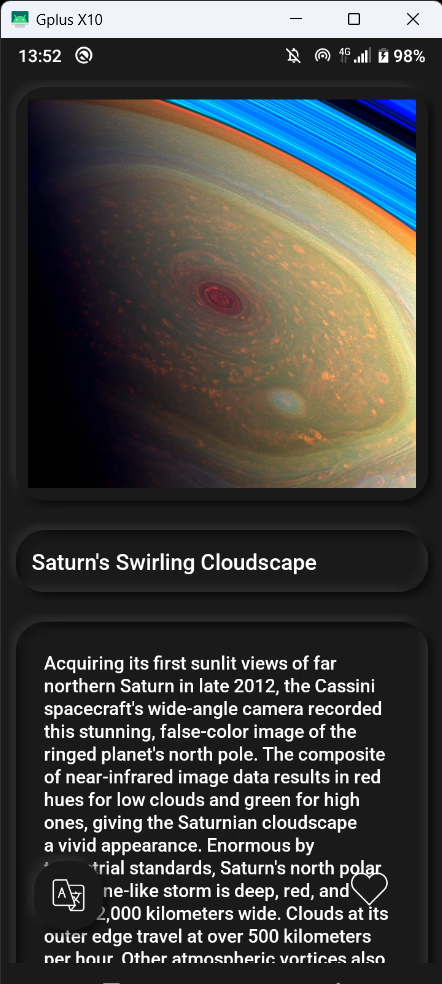
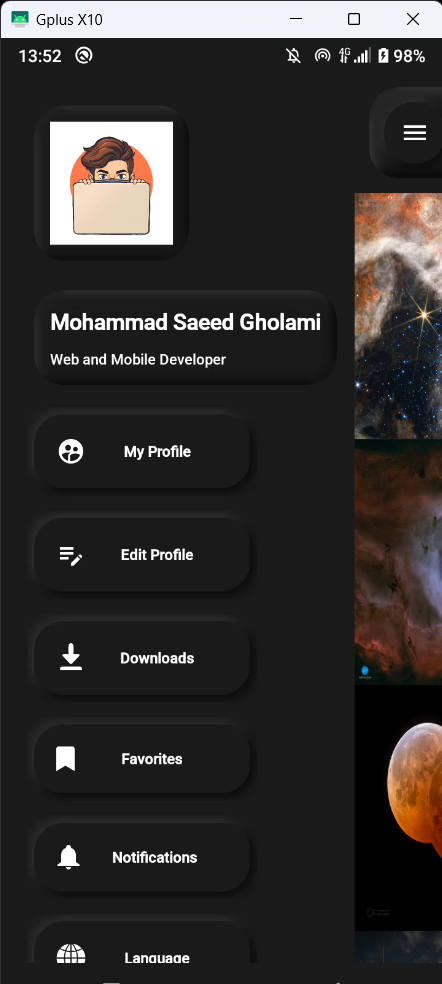
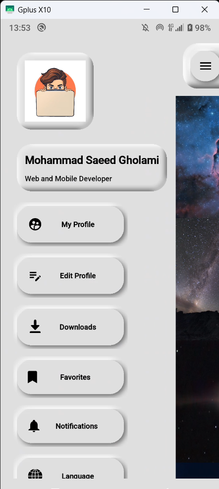
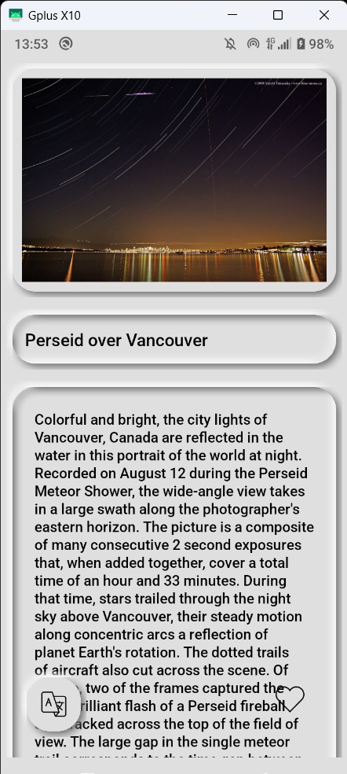
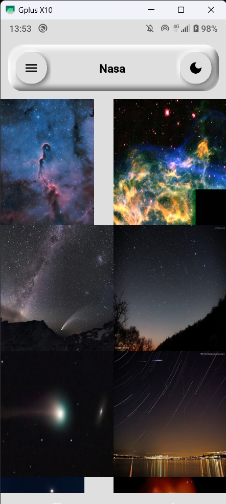

## Screenshots
# 🚀 NASA App – Android Kotlin Project

🎯 **NASA App** is a beautiful Android application built with modern architecture and a clean UI to display amazing daily media from NASA's **APOD API (Astronomy Picture of the Day)**.  
📷🌌 Users can view space images, save them locally, and explore the universe like never before!

---

## 🧰 Technologies & Features

| Feature | Description |
|--------|-------------|
| 🔌 **Retrofit** | For calling NASA’s REST API |
| 🗃️ **Room Database** | To store favorite media locally |
| 🧠 **MVVM Architecture** | Clean separation of logic |
| 🎨 **Neumorphism Design** | Soft UI elements with shadows |
| 🍔 **Custom Navigation Menu** | Interactive and animated side menu |
| 📦 **Dependency Injection** | (If used: Hilt/Dagger - mention it here) |
| 📱 **Lottie Animations** | For animated feedback and transitions |
| 🌐 **LiveData / ViewModel** | For reactive and lifecycle-aware data |
| 🌙 **Dark/Light Theme** | Modern UI with support for dark mode |

---

## 📸 Screenshots

<div align="center">
  
  
  
  
  
  
</div>

---

## 🎥 Demo Video

[🎬 مشاهده ویدیو دموی اپلیکیشن در آپارات](https://aparat.com/v/xwctv05)

---

## 🌌 API Used

This app uses the official NASA API:

🔗 [https://api.nasa.gov/](https://api.nasa.gov/)

To get your **API Key**, visit: [🔐 Get NASA API Key](https://api.nasa.gov/)


این اپلیکیشن اندروید با استفاده از زبان **کاتلین** و معماری **MVVM** توسعه داده شده و از رابط برنامه‌نویسی ناسا برای نمایش تصاویر روز فضایی استفاده می‌کند.  
کاربران می‌توانند تصاویر را ذخیره کنند، لایک کنند و با یک رابط کاربری زیبا و انیمیشن‌های حرفه‌ای، تجربه کاربری دلپذیری داشته باشند.

---

## 📦 Setup & Installation

```bash
git clone https://github.com/Mobojava/NasaApp.git
open in Android Studio

